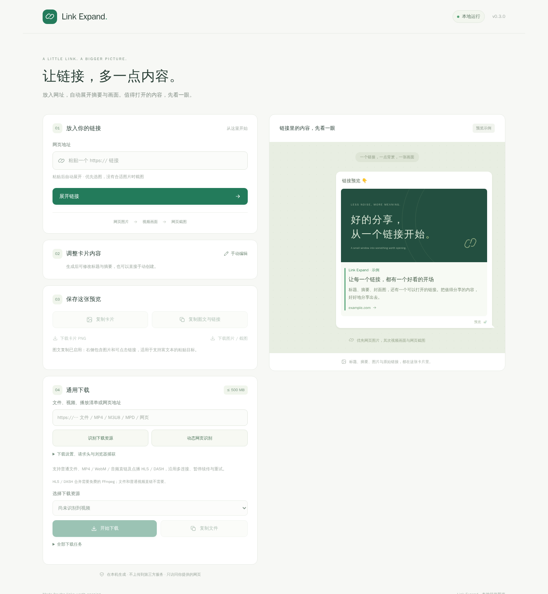

# Link Expand · 本地链接展开

放入一个 URL，自动展开标题、简短摘要和画面。适合先看内容，也可以复制或下载图片。



## Windows 免安装软件

在 [Releases 下载 Windows 版](https://github.com/cuterica/link-expand/releases/latest)。下载 EXE 直接运行，或下载 ZIP 解压后运行其中的 EXE，无需安装 Python。

分发版使用本项目原有的本地网页界面和处理流程。启动后自动打开浏览器，粘贴 URL 即可自动展开。截图使用电脑中已安装的 Edge 或 Chrome；不附带浏览器，以减小分发体积。

使用期间保留启动窗口，退出时关闭它或按 Ctrl+C。默认地址为 <http://127.0.0.1:8765>。同版本已运行时，再次启动会打开原来的页面；旧版本或其他程序占用端口时，新版会选择空闲端口并打开自己的页面，避免接入旧后台。需要指定其他端口时，在命令行运行 `LinkExpand-0.3.0-Windows-x64.exe --port 8766`。

页面右上角显示 `v0.3.0`，右侧按钮为「复制图文与链接」，下方为「通用下载」区域。页面会核对后台版本；旧后台或版本不匹配时会明确提示，并禁用对应功能。

每个发布版本提供 `SHA256SUMS.txt`，可验证下载文件。ZIP 内附第三方组件许可证。软件尚未进行商业代码签名。

## 从源码启动

需要 Python 3.10 或更新版本。首次启动联网安装依赖。截图优先使用已安装的 Chrome / Edge；未安装时自动下载 Chromium。

**Windows：** 双击 `run.bat`，自动创建环境、安装依赖并打开页面。运行环境放在 `%LOCALAPPDATA%\LinkExpand\venv`，避免在 WSL 共享目录中加载依赖时变慢。项目在 WSL 目录时也可以从 Windows 资源管理器打开这个文件。

**macOS / Linux / WSL：**

```bash
bash run.sh
```

装有 uv 时使用 `uv.lock` 锁定依赖；否则使用 Python 的 venv 和 pip。Ubuntu 若缺少 venv，请安装与 Python 版本匹配的 `python3-venv` 包。Linux 的 Chromium 还需要系统图形库；缺少时按 Playwright 的启动提示安装依赖。

默认页面：<http://127.0.0.1:8765>。按 Ctrl+C 停止。端口被占用时执行 `run.bat --port 8766` 或 `bash run.sh --port 8766`。使用 `--no-browser` 可关闭自动打开界面。

## 自动展开流程

1. 把链接粘贴到输入框，稍后自动展开；也可以点击「展开链接」重新获取。
2. 摘要优先使用网页提供的 Open Graph / Twitter / description，没有时提取正文段落并截短。动态页面截图时也尝试读取渲染后的正文。
3. 画面优先选网页封面、视频封面、正文大图。按来源、实际尺寸、比例和画面变化评分，跳过明显的图标、头像和空白图片。
4. 没有合适图片时，启动独立浏览器读取动态图片；发现可播放视频时，在 20%、45%、70% 处取样，选择较清晰、非黑屏的画面。
5. 没有可用视频画面时，截取网页主内容区域。
6. 页面标明「网页封面」「网页图片」「视频截图」或「网页截图」。可下载整张卡片，也可以单独下载所选图片或截图，单独下载保留完整比例。

支持公开网页、直接图片链接和常见 `.mp4` / `.webm` 视频链接。视频加载、编码、流媒体和站点访问限制会影响截图；受限视频会退回网页截图。需要登录、验证码或 DRM 的内容无法保证展开，可使用「手动编辑」补充摘要。

摘要是网页描述或正文摘录，未接入大模型，不会凭空生成内容。初始卡片标注「预览示例」，实际预览使用抓取或手动填写的内容。

## 保存与编辑

- 「手动编辑」修改标题、摘要；同一 URL 保留原来的画面。
- 左侧「复制卡片」保持整张 PNG 图片和当前排版。
- 右侧「复制图文与链接」一次复制图片、标题、摘要和真实 URL。Windows 分发版同时写入桌面聊天使用的图文格式、HTML 富文本和纯文本格式，让支持图文粘贴的微信 / QQ 读取同一次复制中的图片与文字。图片资源保存在本机，便于客户端读取。文字中的 URL 保留为真实链接，图片中的 URL 仍属于图片像素。
- macOS / Linux 浏览器方式使用带内嵌 PNG 的 HTML 富文本，可粘贴到支持富文本的文档、邮件或编辑器。纯文本输入框只会保留文字和链接；接收软件决定如何呈现排版。
- 「下载卡片 PNG」导出整个预览；「下载图片 / 截图」导出画面。

复制图片需要浏览器支持 [Clipboard API](https://developer.mozilla.org/en-US/docs/Web/API/Clipboard/write)，建议使用 Chrome 或 Edge。

## 通用下载

在「通用下载」输入文件、视频、音频、播放清单或网页地址，点击「识别下载资源」，选择资源后点击「开始下载」。普通文件下载不需要先生成预览卡片。每个任务保留原先的 **500,000,000 字节（500 MB）上限**，超过限制会停止，不生成冒充完整视频的截断文件。

| 资源来源 | 当前处理方式 |
| --- | --- |
| HTTP / HTTPS 文件直链 | 保留文件名和后缀，支持 PDF、压缩包、安装包、图片等二进制文件 |
| MP4 / WebM 等音视频直链 | 下载完整原文件，不转码 |
| 公开 X / 推特推文 | 专用解析公开嵌入数据，支持多个视频，自动选择 500 MB 内的最高可用 MP4 |
| 普通网页 | 解析 video / audio / source、Open Graph、JSON-LD、脚本里的媒体地址与文件链接 |
| 动态播放器 | 手动点击「动态网页识别」，在独立临时浏览器中读取播放请求；最长约 28 秒 |
| 复杂或已登录网页 | 使用附带的 Chrome / Edge 捕获扩展，把实际播放请求及必要请求头导入本地软件 |
| HLS 点播 | 主清单、清晰度、独立音轨、TS / fMP4、字节范围、初始化片段、普通 AES-128 密钥、分段续传 |
| DASH 点播 | 音视频轨、SegmentTemplate / Timeline / List / Base、多 Period，下载后合并 |
| 分离音视频文件 | 扩展恰好导入一个视频和一个音频时，额外提供合并为 MP4 的选项 |

下载引擎由本项目独立实现，不调用 IDM、yt-dlp 或 aria2。可设置 1 / 4 / 8 / 16 个并行连接、限速；支持失败重试、暂停、继续、取消、SHA-256 校验、任务列表和进度保存。最多同时下载两个任务，其他任务等待。服务器提供 Range 和稳定资源标识时支持字节续传；不支持时使用单连接，暂停后重新开始。HLS / DASH 保留已完成分段，继续时先校验，再补下载剩余分段。退出软件会暂停任务；资源已变化时重新下载，避免混合新旧内容。

完整文件保存到系统的 `下载/LinkExpand-videos`（为兼容已有版本保留目录名）。下载完成后可「另存文件」；Windows 的「复制文件」复制整个文件的文件列表格式，可粘贴到支持文件粘贴的微信 / QQ 或资源管理器。接收软件决定将它显示为视频还是文件。

### 免费合并组件

普通文件、X 完整 MP4、音视频直链不需要额外组件。**HLS / DASH 和分离音视频合并需要免费的 [FFmpeg](https://ffmpeg.org/)**。不转码，合并在本机进行。程序从 PATH、已安装的 WinGet FFmpeg、软件旁边及 `%LOCALAPPDATA%\LinkExpand\tools` 自动查找；也可通过 `LINK_EXPAND_FFMPEG` 指定完整路径。

Windows 可以自行执行 `winget install --id Gyan.FFmpeg -e`，或将已有的 `ffmpeg.exe` 放在 Link Expand EXE 旁边。本分发版不内嵌 FFmpeg。页面会显示组件是否就绪。

### 浏览器捕获扩展

Windows ZIP 内含 `browser-extension` 文件夹，Release 也提供单独的扩展 ZIP。Chrome / Edge 打开 `chrome://extensions` / `edge://extensions`，开启开发者模式，选择「加载已解压的扩展程序」，加载这个文件夹。

在软件内「下载设置、请求头与浏览器捕获」复制配对码；扩展内填写软件当前本地地址和配对码。到目标网页点击「捕获当前标签页」，播放视频，刷新列表，选中资源并导入。软件内点击「读取浏览器捕获」开始下载。软件重启后需要重新配对。详见 [扩展使用说明](browser-extension/README.md)。

请求头也可以手动填入 JSON，例如 `{"Referer":"https://example.com/"}`。Cookie / Authorization 仅存在本次运行的内存中，不写入任务状态，不随跳转发送给其他来源。需要登录的任务重启后应再次识别或导入以补充请求头。扩展仅处理你手动启用的标签页，十分钟后停止；点击停止会清空捕获列表。

### 兼容范围

通用的部分是 HTTP 下载与有限播放清单；各站的实际媒体定位、登录验证、短期签名、特殊播放器仍会不同。`blob:` 需要捕获背后的网络资源。普通页面识别不能保证覆盖所有网站，动态识别仅执行受限的 GET / HEAD 请求，复杂接口可使用扩展。DRM、需要破解的播放保护、没有结束时间的直播、特殊私有协议不作为完整文件下载。少数编码或清单结构可能无法无损合并到 MP4，会显示失败原因并保留已下载分段。

X 仍优先走公开嵌入数据解析，不需要打开后台浏览器。实测样例：[X 官方开发者公开视频](https://x.com/TwitterDev/status/1460323737035677698)，完整 11.093 秒，1280×720，含 H.264 视频与 AAC 音频。专用接口可能调整，需要持续维护。

## 本地运行

服务仅监听 `127.0.0.1`，网页、摘要和图片不上传到第三方服务。只在输入链接后请求网页和它的公开资源。最近 24 张卡片在内存中保存，退出后清空；不记录 URL、标题和摘要日志。

Windows 图文复制所需的图片缓存位于 `%LOCALAPPDATA%\LinkExpand\clipboard`。为支持退出程序后粘贴，图片会暂时保留；后续复制会清理超过 7 天或最近 48 张之外的旧图片。

下载任务和部分文件在 `下载/LinkExpand-videos/.linkexpand-tasks` 保存，以支持重启后续传。最多保留 32 条任务状态，取消会删除未完成的数据；已完成的文件不会自动删除。任务状态包含来源及媒体地址，可能含网站提供的临时签名，不保存 Cookie / Authorization。

下载限制大小与时长；每次跳转都验证公网地址，并直接连接已验证的 IP。截图浏览器的 HTTP 请求也经同一个下载器处理，限制请求数和总大小，不共享个人浏览器的登录状态。不支持本机 / 内网地址与账号密码 URL。通用下载支持公网 HTTP / HTTPS 非标准端口，卡片预览仍使用标准端口。截图与动态识别使用临时浏览器，不共享个人浏览器配置；退出或超时清理该任务创建的进程。

可以通过 `LINK_EXPAND_FONT` 指定中文 `.ttf` / `.ttc` 字体，通过 `LINK_EXPAND_BROWSER` 指定 Chrome / Edge / Chromium 可执行文件路径。

## 开发与验证

```bash
uv sync --locked
uv run python -m linkexpand.setup_browser
uv run python -m unittest discover -s tests -v
uv run python tests/browser_smoke.py
uv run python tests/video_browser_smoke.py
node tests/extension_smoke.js
uv run python tests/streaming_smoke.py  # 需要 FFmpeg / ffprobe
uv run link-expand --no-browser
```

Python 标准库负责本地 HTTP 服务、受限下载和网页解析；Pillow 生成 PNG；[Playwright](https://playwright.dev/python/docs/network) 在独立进程中生成动态页面与视频截图。界面使用原生 HTML / CSS / JavaScript，无前端构建步骤。

## 构建 Windows 分发版

在 Windows 上使用 Python 3.10 或以上版本，在 PowerShell 中运行：

```powershell
powershell -ExecutionPolicy Bypass -File scripts/build_windows.ps1
```

构建使用独立环境 `%LOCALAPPDATA%\LinkExpand\build-venv`，将 EXE、含说明、扩展与许可证的 ZIP、单独扩展 ZIP、SHA-256 校验文件输出到 `dist`。只打包已有程序及依赖，不更换界面或截图实现。截图子进程在 EXE 中通过专用入口调用同一份 Playwright 代码。
